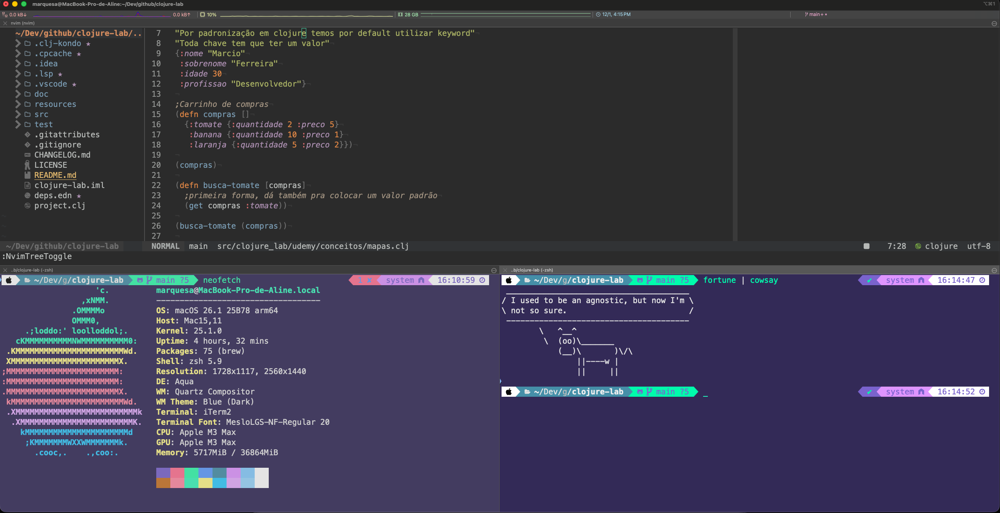

```
███████╗ █████╗ ███╗   ██╗ ██████╗████████╗██╗   ██╗███╗   ███╗
██╔════╝██╔══██╗████╗  ██║██╔════╝╚══██╔══╝██║   ██║████╗ ████║
███████╗███████║██╔██╗ ██║██║        ██║   ██║   ██║██╔████╔██║
╚════██║██╔══██║██║╚██╗██║██║        ██║   ██║   ██║██║╚██╔╝██║
███████║██║  ██║██║ ╚████║╚██████╗   ██║   ╚██████╔╝██║ ╚═╝ ██║
╚══════╝╚═╝  ╚═╝╚═╝  ╚═══╝ ╚═════╝   ╚═╝    ╚═════╝ ╚═╝     ╚═╝
```
---

> __“Order is the foundation of all things.”__ - Descartes

## O que é o Sanctum?

**Sanctum** é o meu santuário pessoal, um conjunto cuidadosamente curado de arquivos de configuração usados em sistemas Unix, Linux e macOS.

Mais do que simples configurações, este repositório representa a base do meu ambiente de desenvolvimento, pensado para ser reproduzível, versionado e evoluir com o tempo.

Ele existe para:
- 📦 **Preservar** e fazer backup das minhas configurações pessoais
- 🔄 **Sincronizar** o ambiente entre múltiplas máquinas
- 📝 **Versionar** mudanças e decisões ao longo do tempo (com Git)
- 🤝 **Compartilhar** conhecimento, ideias e práticas com a comunidade

---



---

## Estrutura do Repositório

```
sanctum/
├── install.sh         # 🚀 Script de instalação automática (macOS)
├── install-ubuntu.sh  # 🐧 Script de instalação automática (Ubuntu)
├── scripts/
│   ├── doctor.sh      # 🏥 Verifica se tudo está OK (macOS)
│   └── doctor-ubuntu.sh # 🏥 Verifica se tudo está OK (Ubuntu)
│
├── artemis/           # Configurações específicas para macOS (MacBook)
│   ├── aerospace/     # Window manager (tiling)
│   ├── skhd/          # Atalhos de teclado globais
│   ├── yabai/         # Window manager alternativo
│   └── Brewfile       # Lista de pacotes do Homebrew
│
├── turing/            # Configurações específicas para Linux (Arch)
│   ├── i3/            # Window manager
│   ├── i3blocks/      # Barra de status
│   └── rofi/          # Launcher de aplicativos
│
├── config/            # Configurações compartilhadas (ambas plataformas)
│   ├── alacritty/     # Terminal emulator
│   ├── ghostty/       # Terminal emulator (recomendado)
│   ├── iterm2/        # iTerm2 (macOS)
│   ├── nvim/          # Neovim (editor de texto)
│   ├── clojure-lsp/   # Language Server para Clojure
│   ├── zshrc          # Configuração do shell Zsh (macOS)
│   ├── zshrc-linux    # Configuração do shell Zsh (Ubuntu)
│   └── p10k.zsh       # Configuração do tema Powerlevel10k
│
├── docs/              # Documentação
│   ├── iterm2-guide.md    # Guia completo do iTerm2
│   ├── keymaps.md         # 🗺️ Guia de atalhos (Neovim, Conjure, iTerm2)
│   ├── keymaps-ubuntu.md  # 🗺️ Guia de atalhos Ubuntu (Alacritty, tmux)
│   └── vm-setup-guide.md  # Guia de criação de VMs (Ubuntu/macOS)
│
├── clojure/           # Configurações globais do Clojure
└── gnupg/             # Configurações do GPG (criptografia)
```
---

## Ferramentas

### Shell

| Ferramenta | O que é | Arquivo |
|------------|---------|---------|
| **Zsh** | Shell mais poderoso que o bash padrão | `config/zshrc` |
| **Oh My Zsh** | Framework de plugins para Zsh | - |
| **Powerlevel10k** | Tema bonito e rápido para o prompt | `config/p10k.zsh` |

### Terminais

| Ferramenta | O que é | Configuração |
|------------|---------|--------------|
| **iTerm2** | Terminal avançado | `config/iterm2/` |
| **Alacritty** | Terminal rápido (GPU-accelerated) | `config/alacritty/` |
| **Ghostty** | Terminal moderno e performático | `config/ghostty/` |

### Editor

| Ferramenta | O que é | Configuração |
|------------|---------|--------------|
| **Neovim** | Editor de texto no terminal | `config/nvim/` |

A configuração do Neovim usa **Fennel** (um Lisp que compila para Lua), mas também tem os arquivos Lua gerados.

### Window Managers

**macOS:**
- **yabai** - Tiling window manager
- **skhd** - Hotkey daemon (atalhos de teclado)
- **aerospace** - Alternativa ao yabai

**Linux:**
- **i3** - Tiling window manager
- **rofi** - Launcher de aplicativos

## Instalação Automática (Recomendado)

### macOS

Em um Mac zerado, abra o **Terminal.app** e execute:

```bash
/bin/bash -c "$(curl -fsSL https://raw.githubusercontent.com/marquesa-lisp/sanctum/main/install.sh)"
```

Isso irá instalar **tudo automaticamente**:
- Xcode Command Line Tools
- Homebrew
- Git, Java, Clojure, Neovim, iTerm2
- Fontes (Nerd Fonts)
- Oh My Zsh + Powerlevel10k
- Criar todos os symlinks

### Ubuntu

Em um Ubuntu zerado, abra o **Terminal** e execute:

```bash
# Instalar git primeiro
sudo apt update && sudo apt install -y git curl

# Clonar e instalar
git clone https://github.com/marquesa-lisp/sanctum.git ~/dev/github/sanctum
cd ~/dev/github/sanctum
./install-ubuntu.sh
```

Isso irá instalar **tudo automaticamente**:
- Zsh + Oh My Zsh + Powerlevel10k
- Neovim, ripgrep, lazygit, fzf
- Java (OpenJDK 11, 17 e 21)
- Clojure CLI + clojure-lsp
- Ghostty (terminal)
- Fontes (Nerd Fonts)
- Criar todos os symlinks

> 📖 Para criar uma VM Ubuntu para testar, veja o [Guia de Criação de VMs](docs/vm-setup-guide.md)

---

## Verificar Instalação

Após a instalação, você pode verificar se tudo está OK:

**macOS:**
```bash
~/dev/github/sanctum/scripts/doctor.sh
```

**Ubuntu:**
```bash
~/dev/github/sanctum/scripts/doctor-ubuntu.sh
```

---

## Instalação Manual

Se preferir instalar passo a passo:

### macOS

1. Instale o [Homebrew](https://brew.sh/):
   ```bash
   /bin/bash -c "$(curl -fsSL https://raw.githubusercontent.com/Homebrew/install/HEAD/install.sh)"
   ```

2. Clone o repositório:
   ```bash
   mkdir -p ~/dev/github
   cd ~/dev/github
   git clone https://github.com/marquesa-lisp/sanctum.git
   ```

3. Instale as dependências usando o **Brewfile**:
   ```bash
   brew bundle --file=~/dev/github/sanctum/artemis/Brewfile
   ```
   
   > 📋 Veja a lista completa em [`artemis/Brewfile`](artemis/Brewfile)

4. Instale o [Oh My Zsh](https://ohmyz.sh/):
   ```bash
   sh -c "$(curl -fsSL https://raw.githubusercontent.com/ohmyzsh/ohmyzsh/master/tools/install.sh)"
   ```

5. Instale o colorls (para o alias `ls`):
   ```bash
   gem install colorls
   ```

6. Crie symlinks para os arquivos de configuração:
   ```bash
   # Zsh
   ln -sf ~/dev/github/sanctum/config/zshrc ~/.zshrc
   ln -sf ~/dev/github/sanctum/config/p10k.zsh ~/.p10k.zsh

   # Neovim
   ln -sf ~/dev/github/sanctum/config/nvim ~/.config/nvim

   # Clojure LSP
   mkdir -p ~/.config/clojure-lsp
   ln -sf ~/dev/github/sanctum/config/clojure-lsp/config.edn ~/.config/clojure-lsp/config.edn

   # Clojure deps.edn global
   mkdir -p ~/.clojure
   ln -sf ~/dev/github/sanctum/clojure/deps.edn ~/.clojure/deps.edn

   # GPG Agent (para assinatura de commits)
   mkdir -p ~/.gnupg && chmod 700 ~/.gnupg
   ln -sf ~/dev/github/sanctum/gnupg/gpg-agent.conf ~/.gnupg/gpg-agent.conf
   ```

7. Reinicie o terminal ou execute:
   ```bash
   source ~/.zshrc
   ```

### Ubuntu

1. Instale as dependências:
   ```bash
   sudo apt update
   sudo apt install -y git curl zsh neovim
   ```

2. Instale o [Oh My Zsh](https://ohmyz.sh/):
   ```bash
   sh -c "$(curl -fsSL https://raw.githubusercontent.com/ohmyzsh/ohmyzsh/master/tools/install.sh)"
   ```

3. Instale plugins do Zsh:
   ```bash
   # Powerlevel10k
   git clone --depth=1 https://github.com/romkatv/powerlevel10k.git \
       ${ZSH_CUSTOM:-$HOME/.oh-my-zsh/custom}/themes/powerlevel10k

   # zsh-autosuggestions
   git clone https://github.com/zsh-users/zsh-autosuggestions \
       ${ZSH_CUSTOM:-$HOME/.oh-my-zsh/custom}/plugins/zsh-autosuggestions

   # zsh-syntax-highlighting
   git clone https://github.com/zsh-users/zsh-syntax-highlighting.git \
       ${ZSH_CUSTOM:-$HOME/.oh-my-zsh/custom}/plugins/zsh-syntax-highlighting
   ```

4. Crie symlinks:
   ```bash
   ln -sf ~/dev/github/sanctum/config/zshrc-linux ~/.zshrc
   ln -sf ~/dev/github/sanctum/config/p10k.zsh ~/.p10k.zsh
   ln -sf ~/dev/github/sanctum/config/nvim ~/.config/nvim
   ln -sf ~/dev/github/sanctum/config/ghostty ~/.config/ghostty
   ```

5. Reinicie o terminal

### Linux (Arch)

1. Instale as dependências:
   ```bash
   sudo pacman -S neovim lazygit fzf zsh
   yay -S zsh-syntax-highlighting zsh-autosuggestions powerlevel10k
   ```

2. Siga os passos 4-7 do macOS

3. Para configurações específicas do i3, copie de `turing/`

## iTerm2 (macOS)

1. Abra iTerm2
2. Vá em `Settings` → `General` → `Preferences`
3. Marque "Load preferences from a custom folder or URL"
4. Aponte para: `~/dev/github/sanctum/config/iterm2`
5. Marque "Save changes to folder when iTerm2 quits"

> 📖 Para instruções detalhadas, veja o [Guia Completo do iTerm2](docs/iterm2-guide.md)

## Aliases

```bash
# Editor
vim → nvim
n → nvim

# Git
ga, gc, gs, gp, gpl, gl, lg

# Java
java11, java23, java24, graalvm24

# Clojure
clj, lt, ct
```

## 📚 Documentação

| Guia | Descrição |
|------|-----------|
| [🗺️ Keymaps - Guia de Sobrevivência](docs/keymaps.md) | Atalhos do Neovim, Conjure, iTerm2 e Terminal. Perfeito para iniciantes! |
| [🖥️ iTerm2 Guide](docs/iterm2-guide.md) | Configuração completa do iTerm2 no macOS |

---

## FAQ

### O que é um symlink?
Um **symlink** é um "atalho" que aponta para outro arquivo. Assim você pode editar os arquivos no repositório e eles são automaticamente usados pelo sistema.

### Posso usar essas configurações?
Sim! Sinta-se livre para copiar, modificar e usar.

---

## Credits

This project is a fork of [lanjoni/dotfiles](https://github.com/lanjoni/dotfiles).  
Original work © [lanjoni](https://github.com/lanjoni) 💜

## License

This is free and unencumbered software released into the public domain.  
For more information, please refer to <http://unlicense.org>
