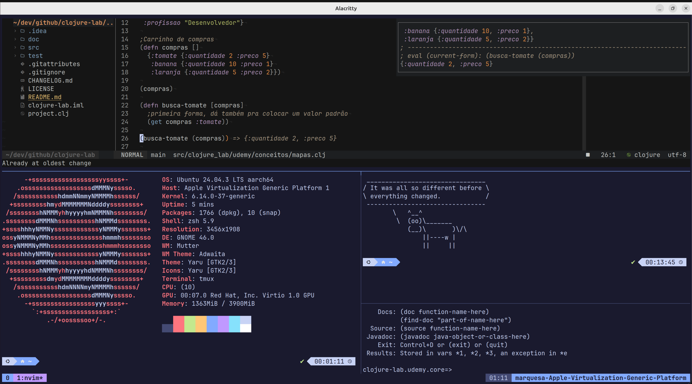

# 🖥️ Guia de Criação de VMs Ubuntu

Este guia ensina como criar uma máquina virtual (VM) com Ubuntu para usar o Sanctum.

## Índice

- [VM Ubuntu no macOS](#vm-ubuntu-no-macos)
  - [UTM (Recomendado)](#opção-recomendada-utm-gratuito)
- [VM Ubuntu no Windows](#vm-ubuntu-no-windows)
  - [VirtualBox (Recomendado)](#opção-1-virtualbox-recomendado-)
  - [VMware Player](#opção-2-vmware-workstation-player-alternativa)
  - [WSL2](#opção-3-wsl2--interface-gráfica-alternativa-leve)
- [Após Instalar o Ubuntu](#após-instalar-o-ubuntu)
- [Checklist de Validação](#checklist-de-validação)
- [Solução de Problemas](#solução-de-problemas)
- [Resultado Final](#resultado-final)

---

## VM Ubuntu no macOS

### Opção Recomendada: UTM (Gratuito)

O **UTM** é a melhor opção para Macs, especialmente com Apple Silicon (M1/M2/M3/M4).

#### 1. Instalar UTM

```bash
brew install --cask utm
```

Ou baixe diretamente: https://mac.getutm.app/

#### 2. Baixar Ubuntu

**Para Mac com Apple Silicon (M1/M2/M3/M4):**

👉 **Link direto (ARM64):** https://cdimage.ubuntu.com/noble/daily-live/current/noble-desktop-arm64.iso

> ⚠️ **Importante:** NÃO baixe a versão "amd64" - ela vai rodar emulada e será muito lenta!

**Para Mac Intel:**
- Baixe o Ubuntu Desktop **AMD64**: https://ubuntu.com/download/desktop
- Use a versão padrão (64-bit)

#### 3. Criar a VM no UTM

1. Abra o **UTM**
2. Clique em **"Create a New Virtual Machine"** ou **"+"**
3. Selecione **"Virtualize"** (mais rápido que Emulate)
4. Escolha **"Linux"**
5. Em **"Boot ISO Image"**, clique em **"Browse"** e selecione o ISO do Ubuntu baixado
6. Configure os recursos:

| Recurso | Recomendado | Mínimo |
|---------|-------------|--------|
| **RAM** | 4 GB | 2 GB |
| **CPU Cores** | 4 | 2 |
| **Disco** | 30 GB | 20 GB |

7. Clique em **"Save"** e depois **"Play"** para iniciar

#### 4. Instalar Ubuntu

1. Selecione **"Try or Install Ubuntu"**
2. Siga o assistente de instalação:
   - Idioma: Português (Brasil) ou English
   - Teclado: Portuguese (Brazil) - ABNT2 ou seu layout
   - Tipo de instalação: **"Erase disk and install Ubuntu"** (é seguro, é dentro da VM)
   - Crie seu usuário e senha
3. Aguarde a instalação e reinicie quando solicitado
4. **Importante:** Quando pedir para remover o disco de instalação, vá em UTM → CD/DVD → Clear para remover o ISO

#### 5. Dicas Úteis no UTM

**Criar Snapshot (salvar estado):**
- Menu: **VM** → **Snapshots** → **Take Snapshot**
- Útil antes de testar scripts, assim você pode voltar se algo der errado

**Compartilhar arquivos com o Mac:**
- Instale o SPICE Guest Tools no Ubuntu:
```bash
sudo apt install spice-vdagent spice-webdavd
```

**Copiar e colar entre Mac e VM:**
- Funciona automaticamente após instalar o spice-vdagent

---

## VM Ubuntu no Windows

> 💡 **Recomendação para iniciantes:** Use o **VirtualBox**. É 100% gratuito, simples de usar e tem muito material de suporte online.

### Opção 1: VirtualBox (Recomendado) ⭐

O **VirtualBox** é a melhor opção para iniciantes: gratuito, simples e bem documentado.

---

#### Pré-requisitos

Antes de começar, verifique se seu computador atende aos requisitos:

| Requisito | Mínimo | Recomendado |
|-----------|--------|-------------|
| **RAM total** | 8 GB | 16 GB |
| **Espaço em disco** | 40 GB livres | 60 GB livres |
| **Processador** | Intel/AMD 64-bit | Intel/AMD com VT-x/AMD-V |
| **Windows** | Windows 10 | Windows 10/11 |

**Verificar se virtualização está habilitada:**
1. Pressione `Ctrl + Shift + Esc` para abrir o Gerenciador de Tarefas
2. Vá na aba **"Desempenho"** → **"CPU"**
3. Procure por **"Virtualização: Habilitado"**

> ⚠️ Se estiver "Desabilitado", você precisa habilitar no BIOS/UEFI do computador (procure por "Intel VT-x" ou "AMD-V").

---

#### Passo 1: Baixar VirtualBox

1. Acesse: **https://www.virtualbox.org/wiki/Downloads**
2. Clique em **"Windows hosts"**
3. Aguarde o download (aprox. 100 MB)

👉 **Link direto:** https://download.virtualbox.org/virtualbox/7.1.4/VirtualBox-7.1.4-165100-Win.exe

---

#### Passo 2: Instalar VirtualBox

1. Execute o arquivo baixado (`VirtualBox-x.x.x-xxxxx-Win.exe`)
2. Clique em **"Next"** nas telas iniciais
3. Na tela de recursos, **deixe tudo marcado** e clique **"Next"**
4. Vai aparecer um aviso sobre rede - clique **"Yes"**
5. Clique em **"Install"**
6. Se pedir permissão do Windows, clique **"Sim"**
7. Ao finalizar, clique em **"Finish"**
8. **Reinicie o computador** (recomendado)

---

#### Passo 3: Baixar Ubuntu

1. Acesse: **https://ubuntu.com/download/desktop**
2. Clique em **"Download Ubuntu Desktop"**
3. Escolha **Ubuntu 24.04.x LTS** (versão estável)
4. Aguarde o download (aprox. 5 GB)

👉 **Link direto:** https://releases.ubuntu.com/24.04/ubuntu-24.04.1-desktop-amd64.iso

> 💡 **Dica:** Enquanto baixa, você pode ir para o próximo passo e criar a VM.

---

#### Passo 4: Criar a Máquina Virtual

1. Abra o **Oracle VM VirtualBox**
2. Clique no botão **"Novo"** (ou `Ctrl + N`)

**Tela 1 - Nome e Sistema Operacional:**
- **Nome:** `Ubuntu` (ou o nome que preferir)
- **Pasta:** deixe o padrão
- **Imagem ISO:** Clique na pastinha e selecione o Ubuntu baixado
- ✅ Marque **"Pular instalação desassistida"** (Skip Unattended Installation)
- Clique em **"Próximo"**

**Tela 2 - Hardware:**
- **Memória RAM:** Arraste para **4096 MB** (4 GB)
  - Se tiver 16 GB ou mais, pode colocar 8192 MB (8 GB)
- **Processadores:** Arraste para **2 ou 4 CPUs**
- Clique em **"Próximo"**

**Tela 3 - Disco Virtual:**
- Selecione **"Criar um disco rígido virtual agora"**
- **Tamanho:** `30 GB` (ou mais se tiver espaço)
- ✅ Marque **"Pré-alocar tamanho total"** para melhor performance
- Clique em **"Próximo"**

**Tela 4 - Resumo:**
- Revise as configurações
- Clique em **"Finalizar"**

---

#### Passo 5: Configurações Extras (Recomendado)

Antes de iniciar a VM, vamos otimizar:

1. Selecione a VM **"Ubuntu"** na lista
2. Clique em **"Configurações"** (ou `Ctrl + S`)

**Aba "Sistema" → "Processador":**
- ✅ Marque **"Habilitar PAE/NX"**
- ✅ Marque **"Habilitar VT-x/AMD-V aninhado"** (se disponível)

**Aba "Tela":**
- **Memória de vídeo:** Arraste para **128 MB**
- **Controlador gráfico:** Selecione **"VMSVGA"**
- ✅ Marque **"Habilitar aceleração 3D"**

**Aba "Armazenamento":**
- Confirme que o ISO do Ubuntu está na unidade de CD/DVD

**Aba "Rede":**
- **Conectado a:** Selecione **"NAT"** (padrão, funciona bem)

Clique em **"OK"** para salvar.

---

#### Passo 6: Instalar o Ubuntu

1. Selecione a VM e clique em **"Iniciar"** (botão verde ▶)
2. A VM vai iniciar e carregar o Ubuntu do ISO

**No instalador do Ubuntu:**

1. Selecione o idioma: **"Português (Brasil)"** ou **"English"**
2. Clique em **"Instalar Ubuntu"**
3. Layout do teclado: **"Portuguese (Brazil)"** - ABNT2
4. Tipo de instalação:
   - Selecione **"Instalação normal"**
   - ✅ Marque **"Baixar atualizações durante a instalação"**
5. Tipo de instalação de disco:
   - Selecione **"Apagar disco e instalar Ubuntu"**
   - ⚠️ Isso é seguro! É o disco virtual, não seu disco real.
   - Clique em **"Instalar agora"** → **"Continuar"**
6. Fuso horário: Clique em **São Paulo** no mapa (ou sua cidade)
7. Crie seu usuário:
   - **Seu nome:** Daniel (ou seu nome)
   - **Nome do computador:** ubuntu-vm
   - **Nome de usuário:** daniel (ou o que preferir)
   - **Senha:** escolha uma senha (vai precisar dela!)
8. Aguarde a instalação (10-20 minutos)
9. Quando terminar, clique em **"Reiniciar agora"**
10. Quando pedir para remover o disco, apenas pressione **Enter**

---

#### Passo 7: Instalar Guest Additions (Muito Importante!)

Após o Ubuntu reiniciar e você fazer login:

1. Abra o **Terminal** (pressione `Ctrl + Alt + T`)
2. Execute os comandos:

```bash
# Atualizar sistema
sudo apt update && sudo apt upgrade -y

# Instalar Guest Additions
sudo apt install -y virtualbox-guest-utils virtualbox-guest-x11

# Reiniciar
sudo reboot
```

**Isso habilita:**
- ✅ Resolução de tela automática (redimensiona com a janela)
- ✅ Copiar e colar entre Windows e Ubuntu
- ✅ Arrastar e soltar arquivos
- ✅ Pastas compartilhadas
- ✅ Melhor performance de vídeo

---

#### Passo 8: Configurar Área de Transferência (Copiar/Colar)

Para copiar e colar entre Windows e Ubuntu:

1. Com a VM rodando, vá no menu **"Dispositivos"**
2. Clique em **"Área de Transferência Compartilhada"**
3. Selecione **"Bidirecional"**

4. Ainda em **"Dispositivos"**
5. Clique em **"Arrastar e Soltar"**
6. Selecione **"Bidirecional"**

Agora você pode copiar texto no Windows (`Ctrl+C`) e colar no Ubuntu (`Ctrl+V`).

---

#### Passo 9: Criar Pasta Compartilhada (Opcional)

Para compartilhar arquivos entre Windows e Ubuntu:

1. Com a VM desligada ou rodando, vá em **"Configurações"**
2. Aba **"Pastas Compartilhadas"**
3. Clique no ícone de **"+"** (Adicionar pasta)
4. Configure:
   - **Caminho da pasta:** Escolha uma pasta no Windows (ex: `C:\Compartilhado`)
   - **Nome da pasta:** `compartilhado`
   - ✅ Marque **"Montar automaticamente"**
   - ✅ Marque **"Tornar permanente"**
5. Clique em **"OK"**

No Ubuntu, a pasta aparece em: `/media/sf_compartilhado`

Para acessar sem sudo:
```bash
sudo adduser $USER vboxsf
sudo reboot
```

---

#### Passo 10: Criar Snapshot (Salvar Estado)

Antes de instalar o Sanctum, crie um snapshot para poder voltar se algo der errado:

1. Menu **"Máquina"** → **"Ferramentas"** → **"Snapshots"**
2. Clique em **"Criar"** (ou `Ctrl + Shift + S`)
3. Dê um nome: "Ubuntu limpo - antes do Sanctum"
4. Clique em **"OK"**

> 💡 **Dica:** Se algo der errado, você pode restaurar esse snapshot e começar de novo.

---

#### Problemas Comuns no VirtualBox

**Tela preta após iniciar:**
- Vá em Configurações → Tela → mude o Controlador Gráfico para "VBoxVGA"

**VM muito lenta:**
- Verifique se a virtualização está habilitada no BIOS
- Aumente a RAM da VM
- Desative o Hyper-V do Windows (pode conflitar)

**Resolução não ajusta:**
- Instale o Guest Additions (Passo 7)
- Menu "Exibir" → "Redimensionar automaticamente tela do convidado"

**Copiar/colar não funciona:**
- Instale o Guest Additions
- Configure área de transferência bidirecional (Passo 8)

**Erro "VT-x is disabled":**
- Habilite a virtualização no BIOS/UEFI do computador

---

### Opção 2: VMware Workstation Player (Alternativa)

O **VMware** tem melhor performance que o VirtualBox em alguns casos.

#### 1. Instalar VMware

1. Baixe em: https://www.vmware.com/products/workstation-player.html
2. Escolha **"Download for Free"** (para uso pessoal)
3. Execute o instalador
4. Reinicie o computador

#### 2. Criar a VM

1. Abra o **VMware Workstation Player**
2. Clique em **"Create a New Virtual Machine"**
3. Selecione **"Installer disc image file (iso)"** e escolha o Ubuntu
4. Configure usuário e senha (ou pule para configurar durante instalação)
5. Configure os recursos:

| Recurso | Recomendado |
|---------|-------------|
| **Disco** | 30 GB |
| **RAM** | 4 GB |
| **CPU** | 2-4 cores |

6. Finalize e inicie a VM

#### 3. Instalar VMware Tools

Após instalar o Ubuntu:

```bash
sudo apt update
sudo apt install -y open-vm-tools open-vm-tools-desktop
sudo reboot
```

---

### Opção 3: WSL2 + Interface Gráfica (Alternativa Leve)

Se você quer algo mais leve que uma VM completa, pode usar WSL2 com interface gráfica.

#### 1. Instalar WSL2

```powershell
# No PowerShell como Administrador
wsl --install -d Ubuntu-24.04
```

#### 2. Configurar GUI (WSLg)

O Windows 11 já vem com WSLg que permite rodar apps gráficos. O Ghostty pode funcionar via WSLg:

```bash
# No terminal WSL
sudo apt update
sudo apt install -y x11-apps

# Testar se GUI funciona
xclock
```

> **Nota:** WSL2 é mais limitado que uma VM completa. Algumas funcionalidades do Ghostty podem não funcionar perfeitamente.

---

## Após Instalar o Ubuntu

Independente de estar no Mac ou Windows, execute estes comandos no Ubuntu:

### 1. Atualizar o Sistema

```bash
sudo apt update && sudo apt upgrade -y
```

### 2. Instalar SPICE Guest Tools (para VMs)

Se você está rodando Ubuntu em uma VM (UTM, VirtualBox, etc.), instale isso para melhor integração:

```bash
sudo apt install -y spice-vdagent spice-webdavd
```

Isso corrige:
- ✅ Cursor do mouse invisível
- ✅ Copiar/colar entre host e VM
- ✅ Redimensionamento automático da tela

### 3. Instalar Git

```bash
sudo apt install -y git curl
```

### 4. Clonar e Instalar o Sanctum

```bash
# Clonar o repositório
git clone https://github.com/marquesa-lisp/sanctum.git ~/dev/github/sanctum

# Entrar no diretório
cd ~/dev/github/sanctum

# Executar o instalador
./install-ubuntu.sh
```

### 5. Reiniciar o Terminal

Feche e abra o terminal novamente, ou execute:

```bash
source ~/.zshrc
```

### 6. Verificar Instalação

```bash
./scripts/doctor-ubuntu.sh
```

---

## Checklist de Validação

Após instalar o Sanctum, verifique se tudo funciona:

### Terminal (Alacritty + tmux)

- [ ] Alacritty abre corretamente (`alacritty`)
- [ ] Fonte JetBrainsMono Nerd Font está funcionando (ícones aparecem)
- [ ] Cores do tema aparecem (fundo escuro azulado)
- [ ] tmux funciona (`tmux`)
- [ ] Split vertical: `Ctrl+A` depois `|` ou `\`
- [ ] Split horizontal: `Ctrl+A` depois `-`
- [ ] Navegar entre painéis: `Alt + setas`

### Shell (Zsh + Powerlevel10k)

- [ ] Prompt do Powerlevel10k aparece bonito
- [ ] Ícones do prompt funcionam (git, etc.)
- [ ] Autosuggestions funciona (texto cinza ao digitar)
- [ ] Syntax highlighting funciona (comandos coloridos)

### Editor (Neovim)

- [ ] `nvim` abre sem erros
- [ ] Plugins carregam automaticamente
- [ ] `Space + e` abre o file explorer (nvim-tree)
- [ ] `Space + f + f` abre o Telescope (busca de arquivos)

### Linguagens

- [ ] `java --version` → mostra Java 21
- [ ] `clojure --version` → mostra Clojure CLI
- [ ] `clojure-lsp --version` → mostra clojure-lsp
- [ ] `node --version` → mostra Node.js (se instalado)

### Ferramentas

- [ ] `git --version` → Git instalado
- [ ] `lazygit` → abre interface do Git
- [ ] `rg --version` → ripgrep instalado
- [ ] `fzf --version` → fzf instalado

---

## Solução de Problemas

### Alacritty não abre

```bash
# Verificar se está instalado
which alacritty

# Se não estiver, instalar
sudo apt install -y alacritty

# Verificar config
ls -la ~/.config/alacritty/
```

### Fontes não aparecem corretamente

```bash
# Reinstalar fontes
cd /tmp
curl -fLO https://github.com/ryanoasis/nerd-fonts/releases/download/v3.3.0/JetBrainsMono.zip
unzip -o JetBrainsMono.zip -d ~/.local/share/fonts
fc-cache -fv
```

### Powerlevel10k não aparece

```bash
# Reconfigurar
p10k configure
```

### Plugins do Neovim não carregam

```bash
# Abrir nvim e rodar
:Lazy sync
```

---

## Resultado Final

Se tudo deu certo, seu ambiente Ubuntu deve ficar assim:



**O que você vê na imagem:**
- **Esquerda superior:** NvimTree (explorador de arquivos)
- **Centro:** Neovim editando código Clojure
- **Direita:** Log do Conjure mostrando resultados do REPL
- **Inferior esquerdo:** Neofetch (informações do sistema)
- **Inferior direito:** REPL do Clojure rodando

---

## Recursos Úteis

- [UTM Documentation](https://docs.getutm.app/)
- [VirtualBox Manual](https://www.virtualbox.org/manual/)
- [VMware Documentation](https://docs.vmware.com/)
- [Ubuntu Desktop Guide](https://help.ubuntu.com/stable/ubuntu-help/)
- [Alacritty Documentation](https://alacritty.org/config-alacritty.html)
